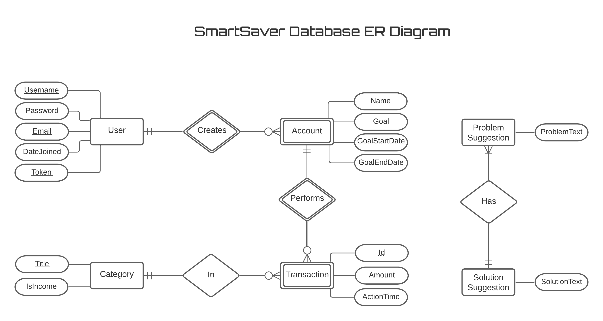

# SmartSaver

### ER Diagram

### Requirements
- [X] Creating and using your own class, **_struct_** and enum (with flag(s), preferably)
- [X] Property (standard, indexed, auto-implemented) usage in struct and class.
- [X] Named and optional argument usage.
- [X] Extension method usage.
- [X] Reading from file.
- [X] Generic type usage.
- [X] Regex.
- [X] Widening and narrowing type conversions.
- [X] Putting data to collection, iterating through it the right way.
- [X] LINQ to Objects usage (methods and queries), including **_groupJoin_**.
- [X] Implementing some of the standard .NET interfaces (IEnumerable, IComparable, IComparer, IEquatable, IEnumerator, etc.)

 

- [ ] Lazy initialization.
- [X] Generics (in delegates, **_events_** and methods).
- [X] Delegates.
- [ ] Events and their usage: standard and custom.
- [X] Exceptions and dealing with them in a meaningfull way.
- [X] Anonymous methods.
- [X] Lambda expressions.
- [X] concurrent programming (threading or async/await (for your own written classes); **_common resource usage between threads_**).
- [X] Config file usage (both - app and user).
- [X] Dependency Injection.

 

- [X] Prepair ER diagram and create the database (MS SQL, but not mandatory - only important to be able to integrate to your solution).
- [ ] Transfer/update data using DataTable and DataAdapter.
- [X] Select/insert/update/delete usage.
- [X] LINQ usage: Join, Group, Skip and Take, Agregate function.
- [X] Entity Framework usage.
